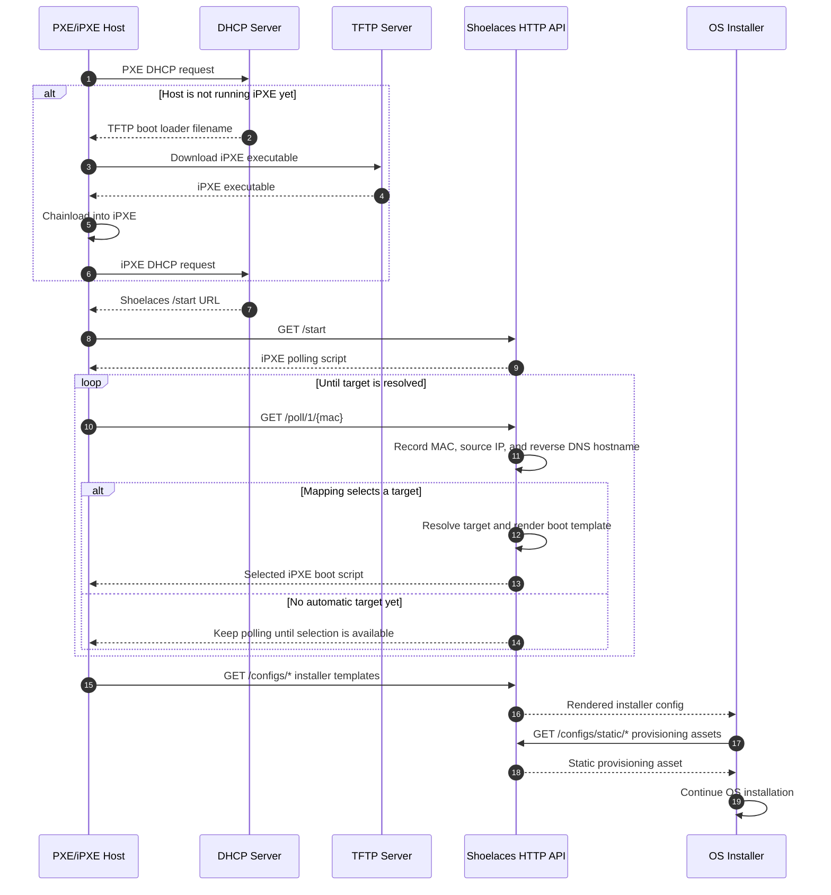
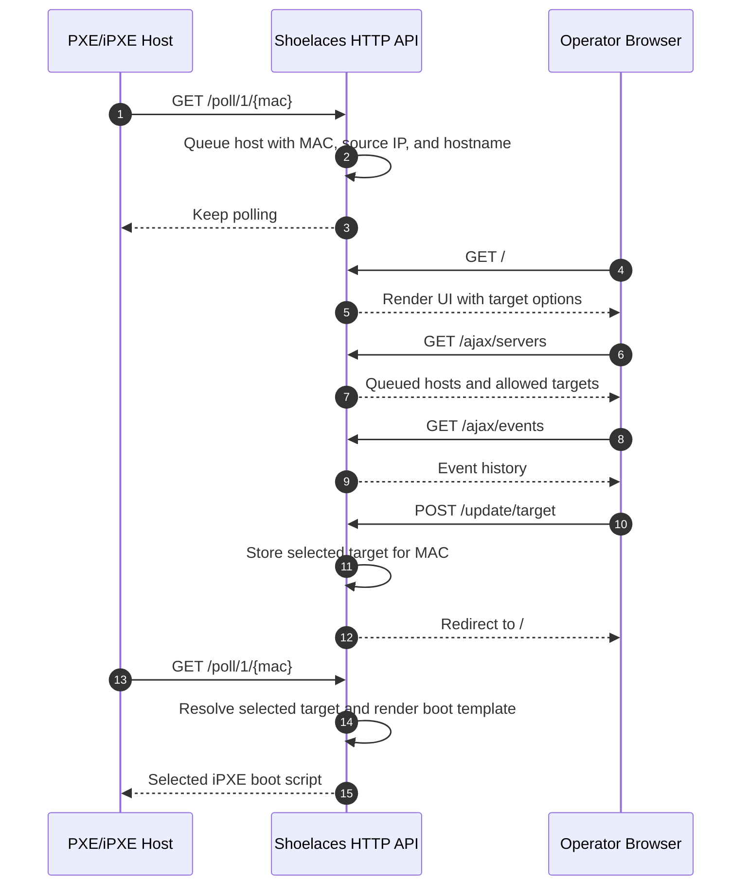

# Network Boot Flow

Shoelaces serves boot scripts and provisioning assets to hosts that boot over PXE/iPXE.
The web UI also shows detected hosts and lets operators choose a boot target when no automatic mapping applies.


## Flow

The API boot chart shows the two-stage boot path without the operator UI. DHCP
and TFTP only get the host into iPXE; after that, iPXE talks to Shoelaces over
HTTP so Shoelaces can resolve a target, render the selected boot template, and
serve provisioning assets.



The UI selection chart shows the manual path for hosts that do not match an
automatic mapping. The host keeps polling the API while an operator reviews the
queued host in the browser and selects an allowed boot target.



If there is no automated installation configured for the host, the UI queues it for manual selection.


Hosts send their MAC address when they contact Shoelaces.
Shoelaces also extracts the source IP from the HTTP request and performs a reverse DNS lookup.
When reverse DNS resolves, the hostname is shown in the UI; otherwise the UI shows the MAC and IP.

See [Provisioning Defaults And Overrides](provisioning-overrides.md) for how
`/configs/*` installer templates, `/configs/static/*` provisioning assets,
embedded defaults, and disk overrides interact after a boot target is selected.

## Requirements

You need a LAN segment with working TFTP and DHCP services.
Any TFTP server should work.
The DHCP server must be able to match iPXE boot clients and return a different boot filename or URL.
The host being provisioned must support network booting over PXE.

Shoelaces can coexist with the TFTP and DHCP services on the same host.

## TFTP

TFTP is only used to chainload the iPXE boot loader, so a read-only TFTP setup is enough.
The common `undionly.kpxe` loader can be downloaded from the [iPXE chainloading docs](http://ipxe.org/howto/chainloading).

You can also compile a custom iPXE executable, for example to add trusted root certificates for HTTPS booting.

## DHCP

For ISC DHCP, replace the placeholders with your TFTP and Shoelaces server addresses:

```txt
# dhcp.conf
next-server <your-tftp-server>;
if exists user-class and option user-class = "iPXE" {
  filename "http://<shoelaces-server>/start";
} else {
  filename "undionly.kpxe";
}
```

For dnsmasq v2.53 or newer:

```txt
dhcp-match=set:ipxe,175 # iPXE sends a 175 option.
dhcp-boot=tag:!ipxe,undionly.kpxe
dhcp-boot=http://<shoelaces-server>/start
```

If your DHCP server cannot express this split, you can compile an iPXE executable with an embedded script to [break the chainloading loop](https://ipxe.org/howto/chainloading#breaking_the_loop_with_an_embedded_script).
