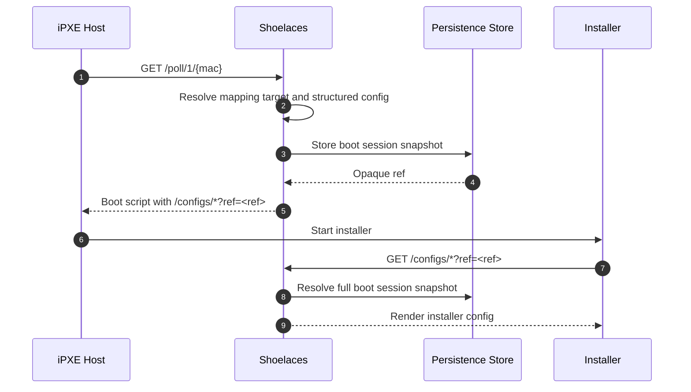

# Runtime Persistence

Shoelaces persists runtime state so a process restart does not lose event
history, waiting hosts, manual target selections, or boot/config references.
This storage is separate from embedded web assets, embedded provisioning
defaults, and operator-owned files under `data-dir`.

## Configuration

Runtime persistence is enabled by default with SQLite:

```yaml
persistence:
  backend: sqlite
  path: runtime/shoelaces.db
  retention:
    events: 720h
    eventsSweepInterval: 24h
    bootSessions: 24h
    bootSessionsSweepInterval: 1h
```

`persistence.path` is resolved relative to `data.dir` unless it is absolute.
The default database path is therefore `data-dir/runtime/shoelaces.db`.
Shoelaces creates the parent directory with restrictive permissions.

The supported backends are:

| Backend | Use |
|---------|-----|
| `sqlite` | Default local durable runtime store. |
| `memory` | Throwaway in-process store for tests and temporary local runs. |

The local development profile in `dev/shoelaces.yaml` uses SQLite at
`dev/data-dir/runtime/shoelaces.db` and can be started with `make dev`.

## Stored Records

| Record | Retention | Purpose |
|--------|-----------|---------|
| Events | `persistence.retention.events` | UI/API event history. Event params are redacted before persistence. |
| Server state | Existing waiting-host expiry | Waiting/manual boot state keyed by MAC address. |
| Boot sessions | `persistence.retention.bootSessions` | Opaque references used by boot scripts and `/configs/*?ref=...`. |

Retention cleanup runs at startup and then periodically according to the sweep
intervals. `eventsSweepInterval` bounds event growth while Shoelaces is
running. `bootSessionsSweepInterval` removes expired boot/config references
without requiring a restart.

## Boot References

When polling resolves a target, Shoelaces stores the resolved target,
environment, host identity, template params, users, and provisioning config in
the persistence store. The rendered boot script receives an opaque `ref`
parameter instead of a long query string with the full structured config.



`/configs/*?ref=...` is the only route that expands a boot ref into the full
stored rendering context. Operator-facing lookup APIs return redacted views:

- `GET /ajax/events` lists event history grouped by MAC.
- `GET /ajax/events/{id}` resolves one redacted event by ULID.
- `GET /ajax/boot-sessions/{ref}` resolves redacted boot reference metadata.
- `GET /ajax/servers` lists currently waiting hosts and allowed manual targets.

Explicit query params on `/configs/*` still act as an override/escape hatch for
routes that already accepted them.

## CQRS Boundaries

The `persistence` package defines backend-neutral records and command/query
interfaces. Backend row types must not leak into handlers, polling, rendering,
or UI code.

| Layer | Allowed dependency |
|-------|--------------------|
| `event`, `server`, `bootsession` | Narrow persistence command/query interfaces. |
| `polling`, `handlers`, `router`, `environment` | Runtime services such as `event.Log`, `server.StateStore`, and `bootsession.Store`. |
| `persistence/sqlite` | sqlc-generated row/query types, Goose migrations, SQLite connection handling. |
| Tests | `persistence/persistencetest` contract tests for backend behavior. |

Writes go through command interfaces such as `EventCommands`,
`ServerStateCommands`, and `BootSessionCommands`. Reads go through query
interfaces such as `EventQueries`, `ServerStateQueries`, and
`BootSessionQueries`. `persistence.Store` embeds both sides for a backend that
can serve the full application.

## Schema Workflow

SQLite schema changes use Goose migrations and sqlc-generated accessors.

1. Add or edit a migration under `persistence/sqlite/migrations/`.
2. Add or edit SQL queries under `persistence/sqlite/query/`.
3. Run `make gen`.
4. Commit the migration/query changes and generated files under
   `persistence/sqlite/db/`.
5. Run `make check-gen` to verify generated files are current.
6. Run the relevant backend contract tests, then `make test`.

`make check-gen` runs sqlc and fails if generated files drift. CI uses that
target so reviewers can trust checked-in generated code.

## Operations

The SQLite database is local runtime state. Back up `data-dir/runtime` if event
history, waiting/manual selection state, or active boot refs need to survive
host replacement. Stop Shoelaces or use a SQLite-safe backup method before
copying a live database.

Deleting the database is safe when you intentionally want to discard runtime
state. Shoelaces will recreate it on startup and reapply Goose migrations, but
it will lose event history, waiting/manual selections, and active boot refs.
Hosts already installing with old `ref` URLs will need to poll again or receive
new installer config URLs.

Shoelaces logs database startup, migration application, boot reference creation,
reference lookup misses/failures, and retention cleanup activity. Use
`log.handler: json` when logs are consumed by a collector.
