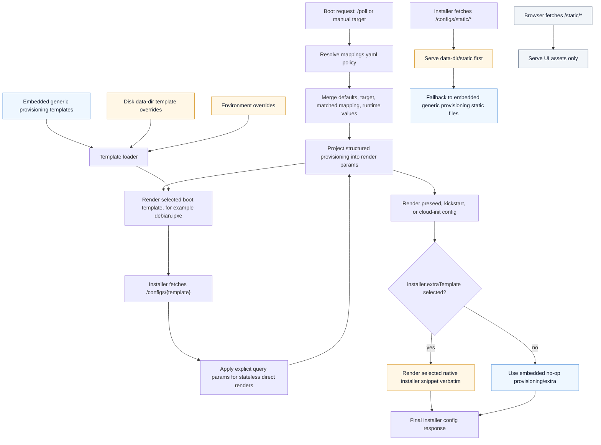

<!-- Copyright 2026 Inngest Inc. -->

# Provisioning Defaults And Overrides

Shoelaces embeds generic provisioning defaults in the binary. These defaults
cover iPXE, preseed, kickstart, cloud-init templates, and a small generic
static provisioning marker. They are intentionally not site policy.

`mappings.yaml` remains external runtime configuration. A Shoelaces host still
needs a `data-dir` containing `mappings.yaml`, but selected targets can point at
embedded template names such as `debian.ipxe` even when no disk template tree is
present.

## Overlay Model

Dynamic templates are loaded in this order:

1. embedded generic provisioning templates
2. disk templates under `data-dir`
3. disk environment overrides under `data-dir/env_overrides/<env>`

If a later layer defines the same template name as an earlier layer, the later
definition wins. This works for complete templates. Common provisioning
settings are rendered from structured `mappings.yaml` policy instead of partial
hooks.

Provisioning static files are served from `/configs/static/*` in this order:

1. `data-dir/env_overrides/<env>/static`, for environment requests
2. `data-dir/static`
3. embedded generic provisioning static files

The UI route `/static/*` is separate and serves only web UI assets.

## Provisioning Flow



## Full Template Overrides

To replace an embedded template completely, provide a disk `.slc` file that
defines the same top-level template name:

```gotemplate
{{define "debian.ipxe" -}}
#!ipxe
echo site Debian boot
{{end}}
```

The file path is only for organization and discovery. The `define` name is the
override contract.

## Native Installer Extra Templates

For site-specific native installer snippets, set `installer.extraTemplate` on
the selected target or mapping. Shoelaces renders that template verbatim near
the end of the installer config. The embedded default `provisioning/extra` is a
no-op.

```yaml
targets:
  debian12:
    script: debian.ipxe
    installer:
      configTemplate: preseed/debian
      extraTemplate: provisioning/debian-extra
```

Then provide the selected template on disk:

```text
data-dir/
  provisioning/
    debian-extra.slc
```

```gotemplate
{{define "provisioning/debian-extra" -}}
d-i preseed/late_command string \
  in-target /bin/sh -c 'echo site late_command override'
{{end}}
```

The snippet is installer-native and Shoelaces does not parse or validate its
syntax beyond normal Go template rendering. A Debian target can emit preseed
lines, a kickstart target can emit `%post`, and a cloud-init target can emit
valid cloud-init YAML such as `runcmd`, `write_files`, or `units`.

## Structured Users

The embedded preseed, kickstart, and cloud-init defaults render users from the
structured `users:` policy in `mappings.yaml`. By default, Debian and Ubuntu
preseeds create a regular user with a locked password:

```text
d-i passwd/user-fullname string Provisioning User
d-i passwd/username string debian
d-i passwd/user-password-crypted password !
```

Set these parameters from `mappings.yaml`, manual request parameters, or query
parameters to customize that user:

- `install_user_fullname`: full name for the regular install user.
- `install_username`: username for the regular install user.
- `install_user_password_crypted`: crypted password hash. Leave unset to keep
  the account locked.

For example:

```yaml
targets:
  debian12:
    script: debian.ipxe
    params:
      release: bookworm
      encrypt_home: false
      install_username: infra
      install_user_fullname: Infrastructure User
      install_user_password_crypted: "$6$rounds=4096$example$salthash"
```

For new mappings, prefer the structured `users:` model. Users are keyed by
username, `root` is configured like any other account, and sensitive fields can
be loaded from the process environment with `{ env: ENV_VAR }`:

```yaml
defaults:
  users:
    root:
      system: true
      locked: true

targets:
  debian12:
    script: debian.ipxe
    params:
      release: bookworm
      encrypt_home: false
    users:
      root:
        locked: false
        passwordCrypted:
          env: SHOELACES_ROOT_PASSWORD_CRYPTED
      infra:
        primary: true
        fullName: Infrastructure User
        passwordCrypted:
          env: SHOELACES_INFRA_PASSWORD_CRYPTED
        sshAuthorizedKeys:
          - env: SHOELACES_INFRA_AUTHORIZED_KEY
        groups:
          - sudo
        shell: /bin/bash
        sudo: ALL=(ALL) NOPASSWD:ALL
```

## Structured Provisioning

Shoelaces also accepts structured provisioning sections on `defaults`, targets,
and mapping rules. These fields are parsed, validated, and merged in the same
order as runtime params: defaults, target, matched mapping rule. Template
rendering migrates to these fields in phases, so `params:` remains available for
low-level template-specific values during the transition.

```yaml
defaults:
  locale:
    language: en_US.UTF-8
    keyboard: us
  time:
    timezone: UTC
    utc: true
    ntp: true
  network:
    bootproto: dhcp
    nameservers:
      - 1.1.1.1
  packages:
    install:
      - openssh-server
      - curl
    groups:
      - core
  storage:
    disk: /dev/nvme0n1
    wipe: true
    mode: lvm
    volumeGroup: vg0
    filesystems:
      root:
        mountpoint: /
        fstype: ext4
        size: grow
      swap:
        fstype: swap
        sizeMiB: 8192
  boot:
    firmware: uefi
    netboot:
      method: ipxe
      kernelArgs:
        - console=ttyS0
    installed:
      bootloader: grub
      timeoutSeconds: 5
      kernelArgs:
        - consoleblank=0
  repos:
    osMirror: https://deb.debian.org/debian
    release: bookworm
    firmware: true
    contrib: true
    nonFree: true
  installer:
    configTemplate: preseed/debian
    extraTemplate: provisioning/extra
    configParams:
      encrypt_home: false
```

Scalar fields merge by replacement. String lists, such as package names and
kernel args, replace inherited lists when set. Keyed maps, such as
`storage.filesystems`, merge by key; set `absent: true` on a filesystem entry
to suppress an inherited entry.

`networkMaps[].network` is the CIDR selector, so network-specific structured
settings on a network map use `networkConfig:`. Other mapping types use
`network:`:

```yaml
networkMaps:
  - network: 192.0.2.0/24
    defaultTarget: debian12
    targets:
      - debian12
    networkConfig:
      hostname: rack-default

macMaps:
  - mac: "0c:42:a1:c3:52:96"
    defaultTarget: debian12
    targets:
      - debian12
    network:
      hostname: iad-1
    storage:
      filesystems:
        swap:
          absent: true
```

## Late Command Scripts

For larger site behavior, keep shell scripts out of the preseed body and serve
them through Shoelaces from an `installer.extraTemplate` snippet.

For a raw script, place it under disk-backed `data-dir/static`:

```text
data-dir/
  static/
    late-command.sh
```

Then reference it through `/configs/static/*`:

```gotemplate
{{define "provisioning/debian-extra" -}}
d-i preseed/late_command string \
  wget -O /target/usr/local/sbin/late-command.sh http://{{ .baseURL }}/configs/static/late-command.sh; \
  chmod 0755 /target/usr/local/sbin/late-command.sh; \
  in-target /usr/local/sbin/late-command.sh
{{end}}
```

For a script that needs Shoelaces template parameters, place a dynamic template
under `data-dir`:

```text
data-dir/
  scripts/
    late-command.sh.slc
```

```gotemplate
{{define "scripts/late-command.sh" -}}
#!/bin/sh
set -eux

hostnamectl set-hostname {{ .hostname }}
{{end}}
```

Then fetch it through `/configs/<template>` and pass required query parameters:

```gotemplate
{{define "provisioning/debian-extra" -}}
d-i preseed/late_command string \
  wget -O /target/usr/local/sbin/late-command.sh "http://{{ .baseURL }}/configs/scripts/late-command.sh?hostname={{ .hostname | urlquery }}"; \
  chmod 0755 /target/usr/local/sbin/late-command.sh; \
  in-target /usr/local/sbin/late-command.sh
{{end}}
```

## Removed Partial Hooks

The embedded defaults no longer support named partial hooks for common
provisioning behavior. Configure packages, locale, time, network, storage,
boot, installer URLs, repositories, and users through structured `mappings.yaml`
fields. Disk files that define old hook names such as
`preseed/debian/late_command`, `ipxe/linux_args`, `ipxe/debian/preseed_url`,
`kickstart/centos/post`, or `cloudconfig/coreos/units` are parsed but are not
called by embedded defaults.

Use full-template replacement when a site needs to replace an entire embedded
template. Use `installer.extraTemplate` when a site needs native installer
snippets or arbitrary imperative behavior.

Embedded defaults do not include site firstboot orchestration, SSH keys,
credentials, Ansible repository URLs, or host enrollment logic. Supply those
from disk-backed extra templates, full-template overrides, or external
automation.
