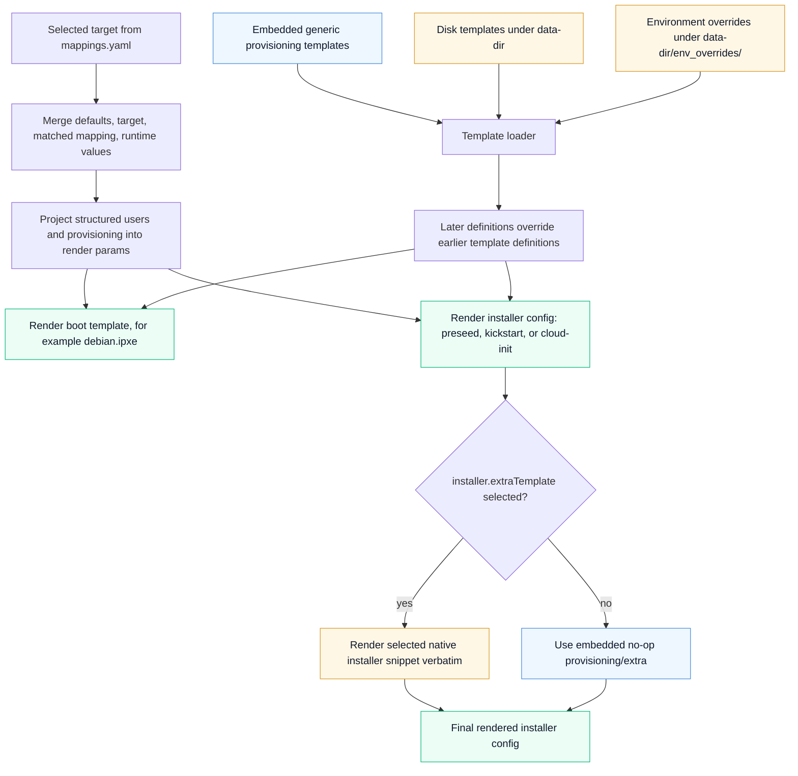
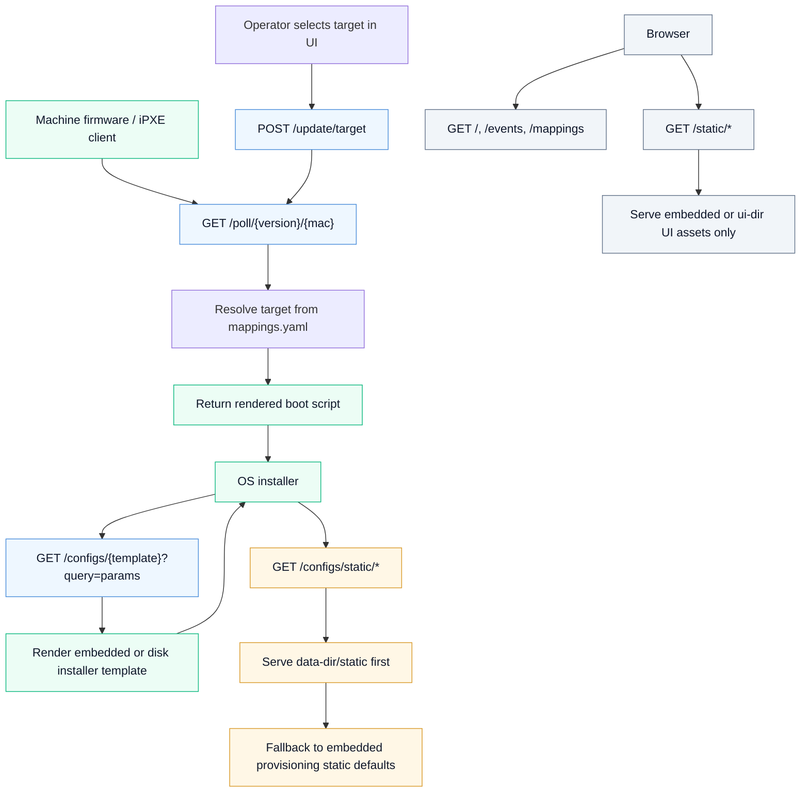

<!-- Copyright 2026 Inngest Inc. -->

# Provisioning Defaults And Overrides

Shoelaces embeds generic provisioning defaults in the binary. These defaults
cover iPXE, preseed, kickstart, cloud-init templates, and a small generic
static provisioning marker. They are intentionally not site policy.

`mappings.yaml` remains external runtime configuration. A Shoelaces host still
needs a `data-dir` containing `mappings.yaml`, but selected targets can point at
embedded template names such as `debian.ipxe` even when no disk template tree is
present.

## Overlay Model

Dynamic templates are loaded in this order:

1. embedded generic provisioning templates
2. disk templates under `data-dir`
3. disk environment overrides under `data-dir/env_overrides/<env>`

If a later layer defines the same template name as an earlier layer, the later
definition wins. This works for complete templates. Common provisioning
settings are rendered from structured `mappings.yaml` policy instead of partial
hooks.

Provisioning static files are served from `/configs/static/*` in this order:

1. `data-dir/env_overrides/<env>/static`, for environment requests
2. `data-dir/static`
3. embedded generic provisioning static files

The UI route `/static/*` is separate and serves only web UI assets.

## Rendering And Override Flow

This chart shows the internal rendering path after a target has been selected.
Structured mapping data is merged and projected into the flat values consumed
by the templates, while template definitions are loaded with deterministic
precedence. Embedded defaults provide the baseline, disk templates can replace
those definitions, and environment overrides are the final layer.
`installer.extraTemplate` is handled separately from declarative rendering: it
is an explicit, operator-selected native snippet rendered verbatim near the end
of the installer config.



## Shoelaces Request Flow

This chart shows the external requests that interact with Shoelaces. Booting
machines poll for a boot script, installers fetch follow-on config templates
and provisioning static files, and browsers use the UI routes. The important
separation is that `/configs/*` belongs to provisioning and `/static/*` belongs
to the web UI. Direct `/configs/{template}` requests are stateless, so explicit
query parameters are still honored even though normal boot rendering starts
from resolved mapping policy.



## Full Template Overrides

To replace an embedded template completely, provide a disk `.slc` file that
defines the same top-level template name:

```gotemplate
{{define "debian.ipxe" -}}
#!ipxe
echo site Debian boot
{{end}}
```

The file path is only for organization and discovery. The `define` name is the
override contract.

## Native Installer Extra Templates

For site-specific native installer snippets, set `installer.extraTemplate` on
the selected target or mapping. Shoelaces renders that template verbatim near
the end of the installer config. The embedded default `provisioning/extra` is a
no-op.

```yaml
targets:
  debian13:
    script: debian.ipxe
    installer:
      configTemplate: preseed/debian
      extraTemplate: provisioning/debian-extra
```

Then provide the selected template on disk:

```text
data-dir/
  provisioning/
    debian-extra.slc
```

```gotemplate
{{define "provisioning/debian-extra" -}}
d-i preseed/late_command string \
  in-target /bin/sh -c 'echo site late_command override'
{{end}}
```

The snippet is installer-native and Shoelaces does not parse or validate its
syntax beyond normal Go template rendering. A Debian target can emit preseed
lines, a kickstart target can emit `%post`, and a cloud-init target can emit
valid cloud-init YAML such as `runcmd`, `write_files`, or `units`.

## Structured Users

The embedded preseed, kickstart, and cloud-init defaults render users from the
structured `users:` policy in `mappings.yaml`. By default, Debian and Ubuntu
preseeds create a regular user with a locked password:

```text
d-i passwd/user-fullname string Provisioning User
d-i passwd/username string debian
d-i passwd/user-password-crypted password !
```

Legacy templates also accept these flat parameters from `mappings.yaml`, manual
request parameters, or query parameters:

- `install_user_fullname`: full name for the regular install user.
- `install_username`: username for the regular install user.
- `install_user_password_crypted`: crypted password hash. Leave unset to keep
  the account locked.

Use them only for compatibility with custom templates that still consume the old
flat names. For example:

```yaml
targets:
  debian13:
    script: debian.ipxe
    repos:
      release: trixie
    installer:
      configParams:
        encrypt_home: false
    params:
      install_username: infra
      install_user_fullname: Infrastructure User
      install_user_password_crypted: "$6$rounds=4096$example$salthash"
```

For new mappings, prefer the structured `users:` model. Users are keyed by
username, `root` is configured like any other account, and sensitive fields can
be loaded from the process environment with `{ env: ENV_VAR }`:

```yaml
defaults:
  users:
    root:
      system: true
      locked: true

targets:
  debian13:
    script: debian.ipxe
    repos:
      release: trixie
    installer:
      configParams:
        encrypt_home: false
    users:
      root:
        locked: false
        passwordCrypted:
          env: SHOELACES_ROOT_PASSWORD_CRYPTED
      infra:
        primary: true
        fullName: Infrastructure User
        passwordCrypted:
          env: SHOELACES_INFRA_PASSWORD_CRYPTED
        sshAuthorizedKeys:
          - env: SHOELACES_INFRA_AUTHORIZED_KEY
        groups:
          - sudo
        shell: /bin/bash
        sudo: ALL=(ALL) NOPASSWD:ALL
```

## Structured Provisioning

Shoelaces also accepts structured provisioning sections on `defaults`, targets,
and mapping rules. These fields are parsed, validated, and merged in the same
order as runtime params: defaults, target, matched mapping rule.

For built-in provisioning behavior, prefer these structured sections over
`params:`. `params:` remains available as an escape hatch for custom site
templates, low-level compatibility values, and explicit manual/request
overrides. When a built-in field is present in both structured config and legacy
mapping params, structured mapping policy is canonical for mapping-resolved
boots; explicit request params can still override for one-off renders.

```yaml
defaults:
  locale:
    language: en_US.UTF-8
    keyboard: us
  time:
    timezone: UTC
    utc: true
    ntp: true
  network:
    bootproto: dhcp
    nameservers:
      - 1.1.1.1
  packages:
    install:
      - openssh-server
      - curl
    groups:
      - core
  storage:
    disk: /dev/nvme0n1
    wipe: true
    wipeDiskPatterns:
      - /dev/nvme*n*
    mode: regular
    filesystems:
      root:
        mountpoint: /
        fstype: ext4
        size: grow
      swap:
        fstype: swap
        sizeMiB: 8192
  boot:
    firmware: uefi
    netboot:
      method: ipxe
      kernelArgs:
        - console=ttyS0
    installed:
      bootloader: grub
      timeoutSeconds: 5
      kernelArgs:
        - consoleblank=0
  repos:
    osMirror: https://deb.debian.org/debian
    release: trixie
    firmware: true
    contrib: true
    nonFree: true
  installer:
    configTemplate: preseed/debian
    extraTemplate: provisioning/extra
    configParams:
      encrypt_home: false
```

Scalar fields merge by replacement. String lists, such as package names and
kernel args, replace inherited lists when set. Keyed maps, such as
`storage.filesystems`, merge by key; set `absent: true` on a filesystem entry
to suppress an inherited entry.

`storage.disk` selects the primary disk that the installer partitions and uses
for the operating system. `storage.wipeDiskPatterns` is separate: it selects the
explicit disk paths or `/dev` glob patterns that installer templates may clear
before partitioning. This lets a host install to one disk while also removing
old partition, mdraid, or LVM metadata from a known disposable disk set.

Structured `storage.mode` rendering currently applies to Debian preseed
targets. Kickstart, Ubuntu-specific installers, CoreOS/Ignition, and cloud-init
storage semantics should be handled as future OS-specific work.

For Debian `storage.mode: regular` and `storage.mode: lvm`,
`storage.filesystems` entries named `esp`, `boot`, `swap`, and `root` override
the default partition sizes, filesystem types, and mountpoints. Root with
`size: grow` uses `sizeMiB` as the minimum and continues to consume remaining
disk space. `regular` is the default and renders a plain GPT/UEFI layout. It
keeps `/boot` as a separate ext4 partition for consistency with LVM and future
encryption-sensitive layouts. In LVM mode, `root` and `swap` are rendered as
logical volumes in the configured `storage.volumeGroup`, so LVM installs should
opt in explicitly:

```yaml
storage:
  mode: regular
  filesystems:
    esp:
      mountpoint: /boot/efi
      sizeMiB: 512
    boot:
      mountpoint: /boot
      fstype: ext4
      sizeMiB: 1024
    swap:
      sizeMiB: 8192
    root:
      mountpoint: /
      fstype: xfs
      size: grow
      sizeMiB: 20000
```

```yaml
storage:
  mode: lvm
  disk: /dev/nvme0n1
  volumeGroup: vg0
```

Debian `regular`, `lvm`, and `raid` modes can be encrypted by setting
`storage.encryption.enabled: true`. The passphrase is required when encryption
is enabled and can be loaded from the Shoelaces process environment. `cipher`,
`keySize`, and `hash` default to `aes-xts-plain64`, `512`, and `sha512`:

```yaml
storage:
  mode: regular
  disk: /dev/nvme0n1
  encryption:
    enabled: true
    passphrase:
      env: SHOELACES_LUKS_PASSPHRASE
```

Encrypted Debian layouts keep the firmware and bootloader path unencrypted. In
`regular` mode, the ESP and `/boot` stay outside LUKS, while swap and root are
separate LUKS volumes. In `lvm` mode, LUKS wraps the physical volume used by
`storage.volumeGroup`, and root and swap are logical volumes inside that volume
group. In `raid` mode, both disks get normal duplicated ESPs, `/boot` is
unencrypted RAID1, and LUKS is placed on the RAID1 devices used for swap and
root.

The rendered Debian preseed must contain the passphrase so the install can run
unattended. Keep encrypted targets behind boot-session references and use a
trusted provisioning network.

Structured `storage.encryption` is Debian-only in the embedded templates.
Ubuntu minimal, CentOS kickstart, CoreOS/cloud-init, and other non-Debian
installer templates fail clearly when it is enabled so they do not silently
render an unencrypted install. For non-Debian encrypted installs, keep using
native installer syntax through `installer.extraTemplate` or a full template
override.

The legacy `plain` value remains parseable in mappings for compatibility with
older generic config, but Debian preseed rejects it clearly. Use `regular` for
new Debian plain-disk installs.

For Debian `storage.mode: raid`, configure RAID member disks separately from
`storage.disk` and `storage.wipeDiskPatterns`. Initial Debian support is
UEFI-only RAID1 with exactly two member disks. Prefer stable
`/dev/disk/by-id/...` paths in production; simple `/dev/nvme0n1` paths are
acceptable for tests and lab hosts:

```yaml
boot:
  firmware: uefi
storage:
  mode: raid
  raid:
    level: 1
    devices:
      - /dev/disk/by-id/nvme-Samsung_SSD_990_PRO_os_a
      - /dev/disk/by-id/nvme-Samsung_SSD_990_PRO_os_b
    bootDegraded: true
```

Debian RAID mode duplicates normal EFI System Partitions across the member
disks rather than putting the ESP on mdraid. The installer mounts one ESP at
`/boot/efi`, installs/copies bootloader files to both ESPs, and uses mdadm for
Linux-managed filesystems such as `/boot`, `/`, and swap. It remains compatible
with Shoelaces/iPXE installer startup when the host network boots a UEFI iPXE
binary; the UEFI-only constraint applies to installed-system disk boot and ESP
layout.

The default Debian RAID sizing is conservative: 512 MiB ESPs on both member
disks, 1 GiB RAID1 ext4 `/boot`, optional RAID1 swap, and a growable RAID1 ext4
root filesystem. The same named `storage.filesystems` entries can override
these defaults across regular, LVM, and RAID modes.

For NVMe-only hosts:

```yaml
storage:
  disk: /dev/nvme0n1
  wipe: true
  wipeDiskPatterns:
    - /dev/nvme*n*
```

For SATA/SCSI-style hosts:

```yaml
storage:
  disk: /dev/sda
  wipe: true
  wipeDiskPatterns:
    - /dev/sd*
```

Use broad patterns such as `/dev/sd*` only on hosts where every matching disk is
known to be disposable. Prefer narrower selectors, such as
`/dev/disk/by-id/<fleet-prefix>*`, when stable disk IDs are available.

`networkMaps[].network` is the CIDR selector, so network-specific structured
settings on a network map use `networkConfig:`. Other mapping types use
`network:`:

```yaml
networkMaps:
  - network: 192.0.2.0/24
    defaultTarget: debian13
    targets:
      - debian13
    networkConfig:
      hostname: rack-default

macMaps:
  - mac: "0c:42:a1:c3:52:96"
    defaultTarget: debian13
    targets:
      - debian13
    network:
      hostname: iad-1
    storage:
      filesystems:
        swap:
          absent: true
```

## Late Command Scripts

For larger site behavior, keep shell scripts out of the preseed body and serve
them through Shoelaces from an `installer.extraTemplate` snippet.

For a raw script, place it under disk-backed `data-dir/static`:

```text
data-dir/
  static/
    late-command.sh
```

Then reference it through `/configs/static/*`:

```gotemplate
{{define "provisioning/debian-extra" -}}
d-i preseed/late_command string \
  wget -O /target/usr/local/sbin/late-command.sh http://{{ .baseURL }}/configs/static/late-command.sh; \
  chmod 0755 /target/usr/local/sbin/late-command.sh; \
  in-target /usr/local/sbin/late-command.sh
{{end}}
```

For a script that needs Shoelaces template parameters, place a dynamic template
under `data-dir`:

```text
data-dir/
  scripts/
    late-command.sh.slc
```

```gotemplate
{{define "scripts/late-command.sh" -}}
#!/bin/sh
set -eux

hostnamectl set-hostname {{ .hostname }}
{{end}}
```

Then fetch it through `/configs/<template>` and pass required query parameters:

```gotemplate
{{define "provisioning/debian-extra" -}}
d-i preseed/late_command string \
  wget -O /target/usr/local/sbin/late-command.sh "http://{{ .baseURL }}/configs/scripts/late-command.sh?hostname={{ .hostname | urlquery }}"; \
  chmod 0755 /target/usr/local/sbin/late-command.sh; \
  in-target /usr/local/sbin/late-command.sh
{{end}}
```

## Removed Partial Hooks

The embedded defaults no longer support named partial hooks for common
provisioning behavior. Configure packages, locale, time, network, storage,
boot, installer URLs, repositories, and users through structured `mappings.yaml`
fields. Disk files that define old hook names such as
`preseed/debian/late_command`, `ipxe/linux_args`, `ipxe/debian/preseed_url`,
`kickstart/centos/post`, or `cloudconfig/coreos/units` are parsed but are not
called by embedded defaults.

Use full-template replacement when a site needs to replace an entire embedded
template. Use `installer.extraTemplate` when a site needs native installer
snippets or arbitrary imperative behavior.

Embedded defaults do not include site firstboot orchestration, SSH keys,
credentials, Ansible repository URLs, or host enrollment logic. Supply those
from disk-backed extra templates, full-template overrides, or external
automation.
